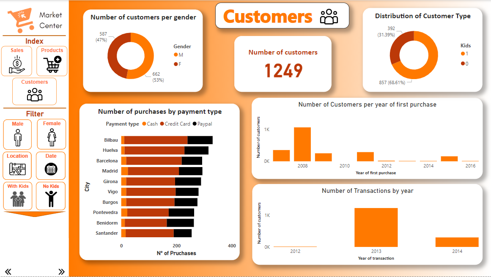
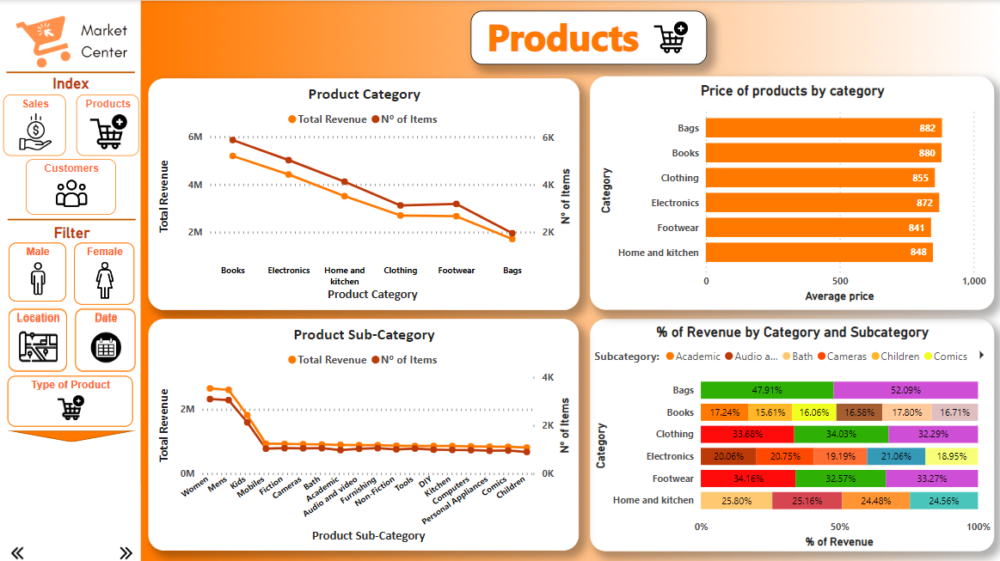
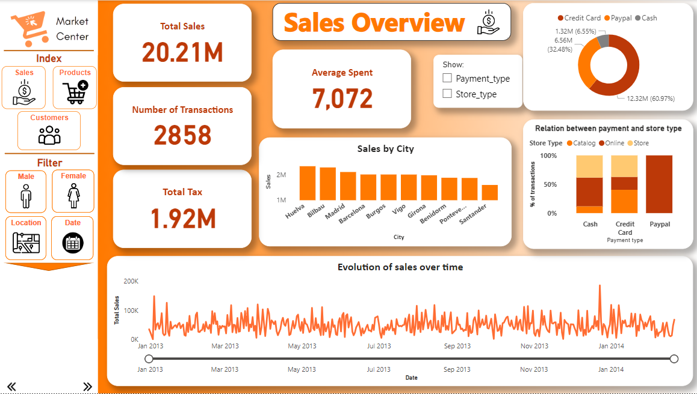

# Market Center - Data Preprocessing and Visualization

## Project Overview
This project analyzes transactional data from the "Market Center" to understand customer behavior, sales trends, and product performance. The analysis involved creating three interactive dashboards using Power BI, highlighting key insights on customers, products, and sales. The goal was to enable data-driven decision-making for business improvement.

## Objective
The objectives of this project were to:
1. Develop cohesive dashboards in Power BI for comprehensive analysis.
2. Extract actionable insights on customer demographics, sales trends, and product performance.
3. Present findings in a clear, concise, and visually appealing manner.

## Problem Statement
Market Center lacked an effective way to analyze its transactional data for business strategy. Key challenges included:
- Understanding customer profiles and purchase behaviors.
- Identifying top-performing products and sales channels.
- Deriving insights to optimize business operations and enhance customer engagement.

## What Was Done
### Data Preprocessing
1. **Exploratory Data Analysis**:
   - Examined variables such as transaction ID, customer demographics, sales channels, and product categories.
2. **Data Cleaning**:
   - Handled missing values and inconsistencies in variables like payment type and product subcategories.
3. **Feature Engineering**:
   - Created new variables, such as total revenue per category and customer tenure, for analysis.

### Dashboard Development in Power BI
1. **Customers Dashboard**:
   - Gender distribution, customer type (with/without kids), and first purchase trends.
   - Number of purchases by payment type and city.
   - Number of customers by year of first purchase and transactions by year.

2. **Products Dashboard**:
   - Revenue and number of items sold by product category and subcategory.
   - Product prices and their contribution to total revenue.
   - Percentage of revenue by category and subcategory.

3. **Sales Overview Dashboard**:
   - Total sales, transactions, and tax collected.
   - Sales by city, payment type, and store type.
   - Evolution of sales over time.

### Key Insights
- **Customer Behavior**:
  - Male customers made up 53% of the customer base.
  - 68% of customers had kids.

      
    *Figure: Customer Behavior*

- **Product Performance**:
  - Books and electronics generated the highest revenue.
  - Bags and footwear had the lowest sales.

      
    *Figure: Product Performance*

- **Sales Trends**:
  - Total sales revenue: 20.21M; Average transaction amount: 7,072.
  - Credit card was the most preferred payment method (60.97%).
  - Most sales occurred online, followed by in-store transactions.

      
    *Figure: Sales Overview*

## Recommendations
1. **Targeted Marketing**:
   - Develop campaigns for families with kids to boost engagement.
2. **Inventory Optimization**:
   - Focus on high-revenue categories like books and electronics.
3. **Payment Method Incentives**:
   - Offer discounts or rewards for using underutilized payment methods like cash.

## Conclusion
This project provided actionable insights into customer profiles, product performance, and sales trends. The dashboards serve as a comprehensive tool for monitoring business performance and making informed decisions to drive growth.
